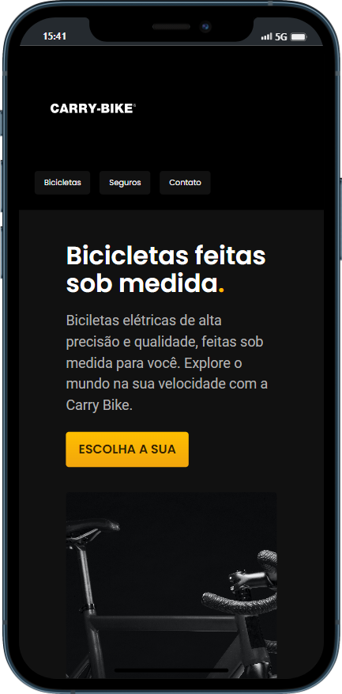
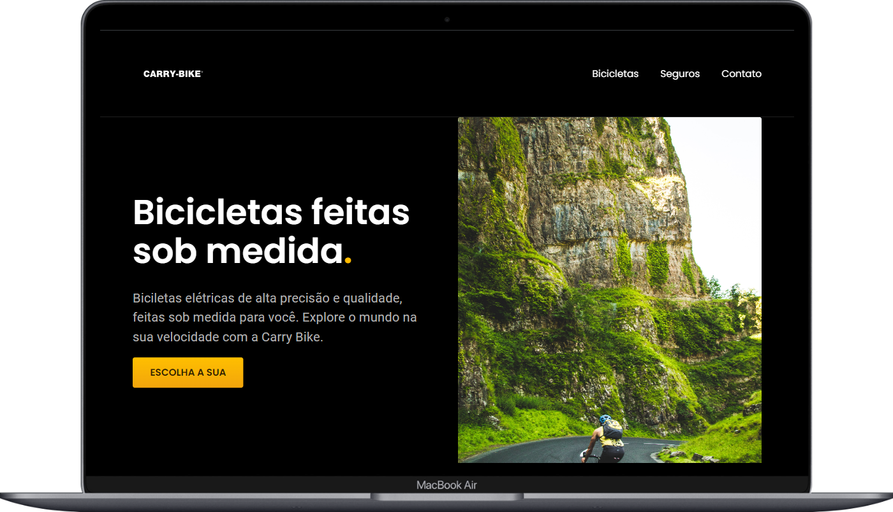

# Carry-Bike

<h1 align="center"> Carry-Bike </h1>

  <a href="#-tecnologias">Tecnologias</a>&nbsp;&nbsp;&nbsp;|&nbsp;&nbsp;&nbsp;
  <a href="#-projeto">Projeto</a>&nbsp;&nbsp;&nbsp;|&nbsp;&nbsp;&nbsp;
  <a href="#-contribuições">Contribuições</a>&nbsp;&nbsp;&nbsp;|&nbsp;&nbsp;&nbsp;

## 🎥 Demo
  O projeto está no ar e para acessá-lo basta [clicar aqui](https://carrybike.vercel.app/).
  
  

    
    
      

## 🚀 Tecnologias

Esse projeto foi desenvolvido com as seguintes tecnologias:

- HTML e CSS
- Git e Github
  
## 💻 Projeto 
  A página foi criada com HTML e CSS para que você possa navegar facilmente e encontrar as informações que precisa. O menu de navegação no topo da página permite acessar rapidamente as diferentes seções da loja, incluindo bicicletas, seguros e como entrar em contato conosco.

Na seção de bicicletas, você pode conferir nossos modelos em destaque com imagens, preços e a opção de compra. Também temos outras categorias de bicicletas que podem ser encontradas em nosso menu de navegação.

## 🤝 Contribuições

Este repositório é aberto à contribuições de toda a comunidade. Se você deseja contribuir para este projeto, por favor, siga as orientações abaixo:

1. Crie um fork deste repositório para sua própria conta.
2. Clone o repositório a partir do seu fork.
3. Crie uma branch para trabalhar nas suas alterações.
4. Faça as alterações necessárias no código.
5.Certifique-se de testar suas alterações antes de submeter um pull request.
6. Faça um commit e um push das suas alterações para o seu fork.
7. Submeta um pull request para o repositório principal, explicando as suas alterações de forma clara e detalhada.
8. Aguarde a revisão e aprovação do seu pull request.

